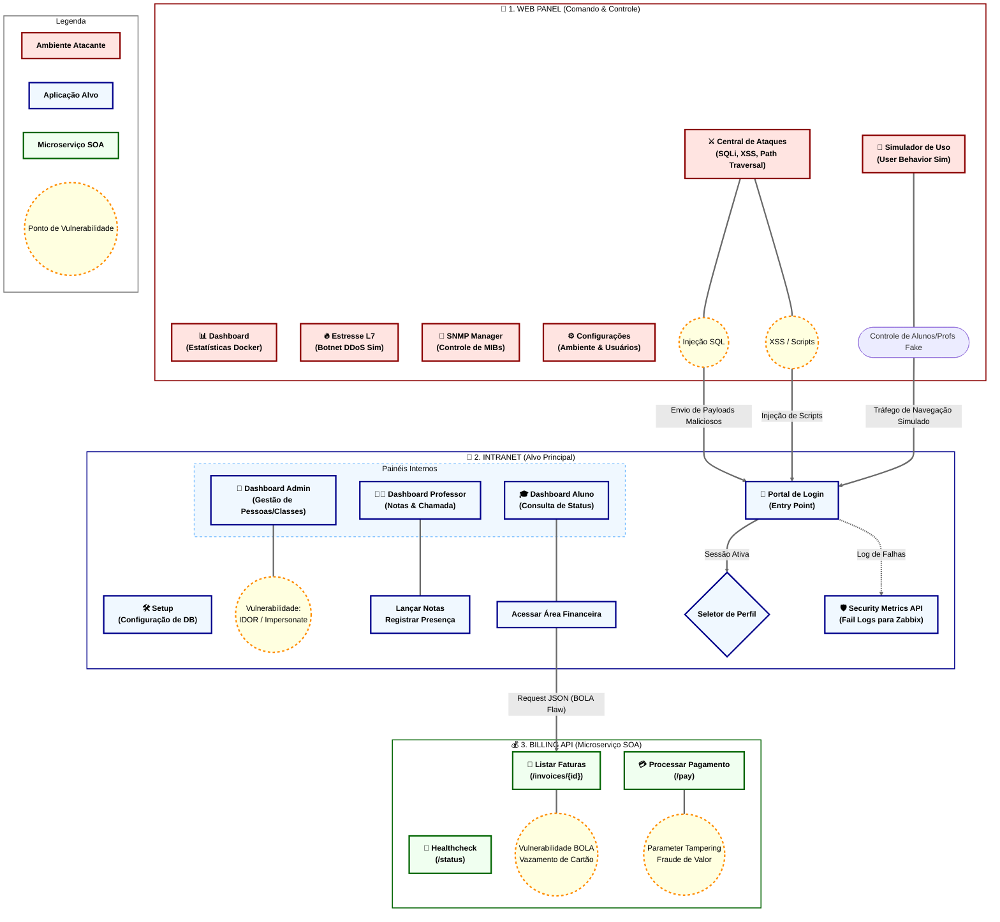

# Diagrama de Funcionalidades e Rotas

Este documento detalha a arquitetura lógica, os fluxos de dados e os pontos de vulnerabilidade dos sistemas que compõem o ecossistema de monitoramento.

## Mapa de Fluxo e Interações

## Detalhamento das Rotas e Funcionalidades

### 1. Web Panel (`/web_panel`)
Interface de controle utilizada para orquestrar as simulações e ataques contra a infraestrutura.

| Rota | Função Técnica | Detalhes |
| :--- | :--- | :--- |
| `/` | `read_root` | Dashboard central com métricas de consumo de CPU/Memória dos simuladores. |
| `/attacks` | `attacks_page` | Disparo de injeções (SQLi, XSS, Path Traversal) via POST para a Intranet. |
| `/simulation` | `simulation_page` | Ativação da Botnet que emula comportamento de Alunos e Professores. |
| `/stress` | `stress_page` | Geração de carga volumétrica para testar as regras de Firewall/IPS. |
| `/devices` | `devices_page` | Controle de simuladores SNMP (Nobreaks, Sensores de Temperatura). |
| `/admin` | `admin_page` | Gestão de usuários do próprio Painel de Controle. |

### 2. Intranet (`/intranet/web`)
Aplicação acadêmica completa, servindo como o alvo principal do monitoramento.

| Rota | Função Técnica | Detalhes |
| :--- | :--- | :--- |
| `/setup` | `setup_post` | Configuração dinâmica da conexão com o MySQL e criação de tabelas. |
| `/login` | `login` | Autenticação central. Falhas aqui são enviadas ao Zabbix. |
| `/admin_dashboard`| `admin_dashboard` | Painel de gestão. Inclui a função `/admin/impersonate/{role}/{id}`. |
| `/prof_dashboard` | `prof_dashboard` | Visualização de turmas e chamada (`/attendance`) e notas (`/grade`). |
| `/student_dashboard`| `student_dashboard`| Consulta de faturas (consome a API de Billing). |
| `/security/metrics`| `security_metrics`| API que expõe tentativas de login malsucedidas em formato JSON. |

### 3. Billing API (`/intranet/billing_api`)
Microserviço que simula uma arquitetura SOA com vulnerabilidades de design.

| Rota | Função Técnica | Detalhes |
| :--- | :--- | :--- |
| `/invoices/{id}` | `get_invoices` | Retorna faturas. **Vulnerabilidade BOLA**: Permite ver faturas de outros IDs. |
| `/pay` | `pay_invoice` | Processa pagamentos. **Parameter Tampering**: Confia no valor enviado pelo cliente. |
| `/status` | `status` | Retorna o status da réplica e saúde do microserviço. |

---
*Este diagrama é atualizado automaticamente conforme novas rotas são integradas ao sistema.*
