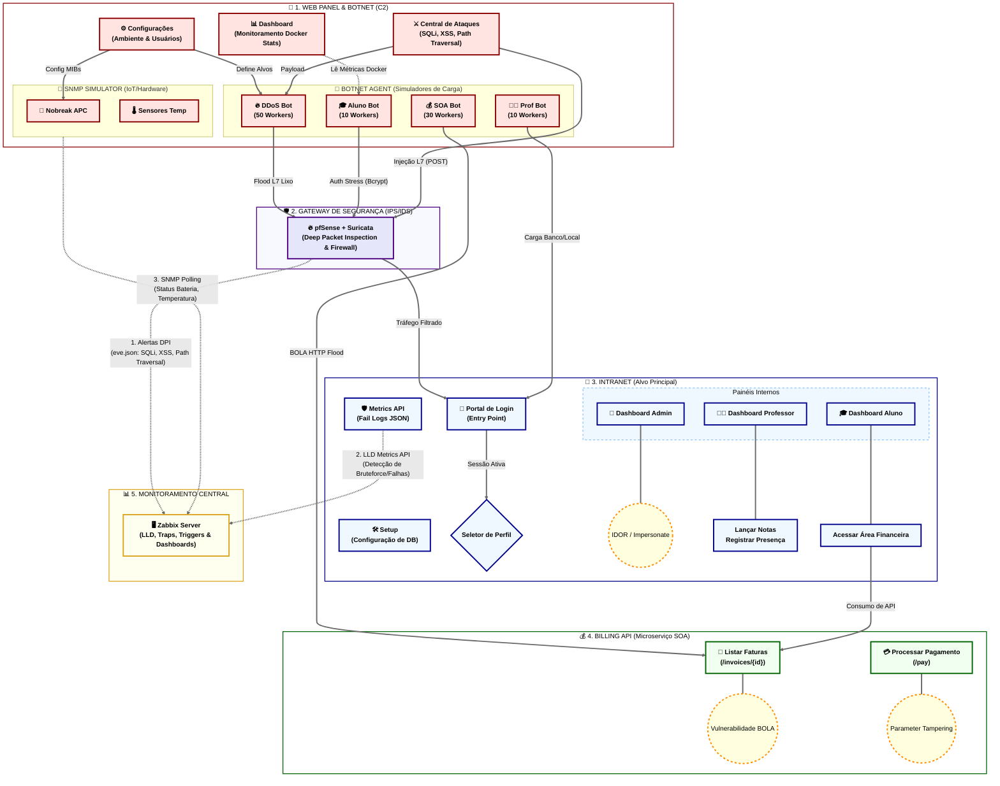
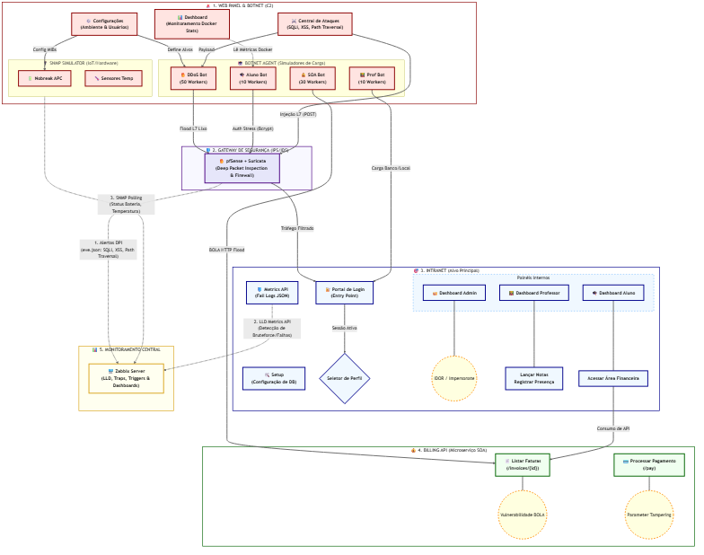

# Diagrama de Funcionalidades e Rotas

Este documento detalha a arquitetura lógica, os fluxos de dados, os pontos de vulnerabilidade e a capacidade de carga da Botnet que compõem o ecossistema de monitoramento.

## Mapa de Fluxo, Interações e Capacidade de Carga

> **Dica para uso no Word:** O diagrama acima foi convertido para uma imagem pronta para ser copiada e colada.  
> 

## Especificações Técnicas e Carga do Sistema

### 1. Botnet Agent (Capacidade de Simulação)
O projeto utiliza um motor assíncrono (`aiohttp`) para gerar carga volumétrica e estressar o monitoramento.

| Tipo de Bot | Qtd de Workers | Ações Principais | Impacto no Monitoramento |
| :--- | :---: | :--- | :--- |
| **DDoS Bot** | 50 | POST Flood com payload de 20KB de dados lixo. | Estresse de CPU e Tráfego no pfSense/Suricata. |
| **Aluno Bot** | 10 | Login (Bcrypt), navegação randômica, consulta de notas. | Estresse de CPU (Criptografia) nos containers. |
| **Prof Bot** | 10 | Login, lançamento de notas em massa, registro de presença. | Estresse de I/O de Banco de Dados (MySQL). |
| **SOA Bot** | 30 | Acesso direto a faturas (BOLA) e fraudes de valor (Tampering). | Gatilhos de DLP e Estresse na Billing API. |

### 2. Os 3 Pilares do Monitoramento (Zabbix)
A integração com o **Zabbix Server** ocorre lendo métricas de 3 camadas distintas da infraestrutura:

1. **Inspeção Profunda (DPI) via Suricata**:
   * O tráfego dos bots passa pelo **pfSense**.
   * O **Suricata** analisa os pacotes (Layer 7) procurando assinaturas maliciosas (SQLi, XSS, Path Traversal disparados pelo `WP_Attacks`).
   * Alertas são escritos no `eve.json` e lidos pelo Zabbix (Log Trapping).
2. **Monitoramento de Aplicação (Bruteforce)**:
   * A Intranet possui uma API em `/security/metrics` que expõe logs em tempo real de tentativas de login malsucedidas.
   * O Zabbix utiliza **LLD (Low-Level Discovery)** para alertar ataques de Bruteforce (vindos do *Aluno Bot*).
3. **Monitoramento IoT/Hardware (SNMP)**:
   * O **SNMP Simulator** emula dispositivos reais (Nobreaks APC, Sensores de Temperatura).
   * O Zabbix realiza *Polling* ativo utilizando as MIBs e Templates (`zabbix_templates/`) configurados no projeto, acionando triggers caso a bateria caia ou a temperatura suba.

### 3. Recursos de Infraestrutura (VEX)
O projeto está preparado para rodar em arquiteturas virtualizadas com as seguintes metas:

- **Gateway/Firewall**: pfSense (Mínimo 2 vCPUs, 2GB RAM para aguentar o Suricata inline).
- **Alvo (Intranet + API + DB)**: VM com 4 vCPUs e 4GB RAM (Recomendado devido ao Bcrypt stress).
- **Atacante (Web Panel + Bots)**: VM Dockerizada com 2 vCPUs e 2GB RAM.
- **Monitoramento**: VM Zabbix Server 6.0 LTS (2 vCPUs, 2GB RAM).

---
*Este diagrama é atualizado automaticamente conforme novas rotas ou capacidades de carga são integradas ao sistema.*
