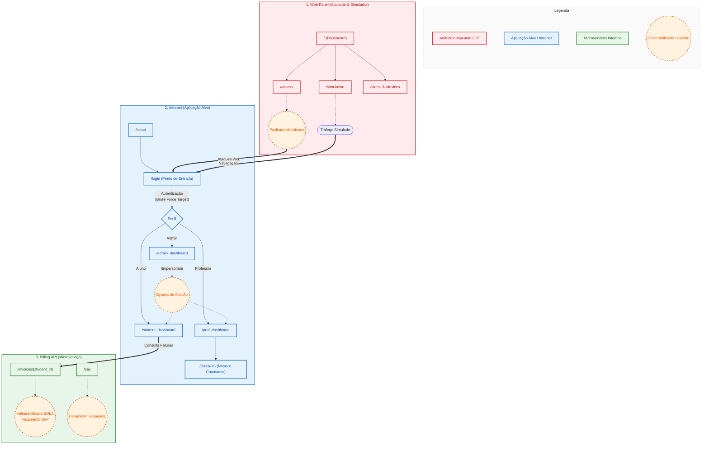

# Diagrama de Funcionalidades e Rotas

Este documento descreve o fluxo lógico e as rotas dos componentes principais do projeto: `web_panel`, `intranet` e `billing_api`.

## Visão Geral do Sistema

O projeto é composto por três blocos principais que interagem entre si para simular um ambiente acadêmico monitorado por sistemas de segurança (pfSense, Suricata, Zabbix).

## Detalhamento de Rotas

### 1. Web Panel (`/web_panel`)
Responsável por orquestrar os ataques e as simulações.

| Rota | Função | Descrição |
| :--- | :--- | :--- |
| `/` | `read_root` | Dashboard principal com status dos containers. |
| `/attacks` | `attacks_page` | Interface para disparar ataques (SQLi, XSS). |
| `/simulation` | `simulation_page` | Controle de simuladores de usuários legítimos. |
| `/devices` | `devices_page` | Gerenciamento de instâncias SNMP. |
| `/api/docker/stats` | `get_docker_stats` | API para métricas de performance dos containers. |

### 2. Intranet (`/intranet/web`)
Aplicação principal que sofre os ataques e gera logs de acesso.

| Rota | Função | Descrição |
| :--- | :--- | :--- |
| `/setup` | `setup_get/post` | Configuração inicial da conexão com MySQL. |
| `/login` | `login` | Ponto central de autenticação (Gatilho de Brute Force). |
| `/admin_dashboard`| `admin_dashboard` | Gestão total de alunos, professores e turmas. |
| `/security/metrics`| `security_metrics`| Endpoint de métricas de falha (usado pelo Zabbix). |
| `/admin/impersonate`| `impersonate_user`| Permite admin assumir outra conta (Vulnerabilidade lógica). |

### 3. Billing API (`/intranet/billing_api`)
Microserviço isolado para simular vulnerabilidades modernas (SOA).

| Rota | Função | Descrição |
| :--- | :--- | :--- |
| `/invoices/{id}` | `get_invoices` | Vulnerável a BOLA (Broken Object Level Authorization). |
| `/pay` | `pay_invoice` | Vulnerável a Parameter Tampering (Fraude no valor). |
| `/status` | `status` | Healthcheck do serviço. |
