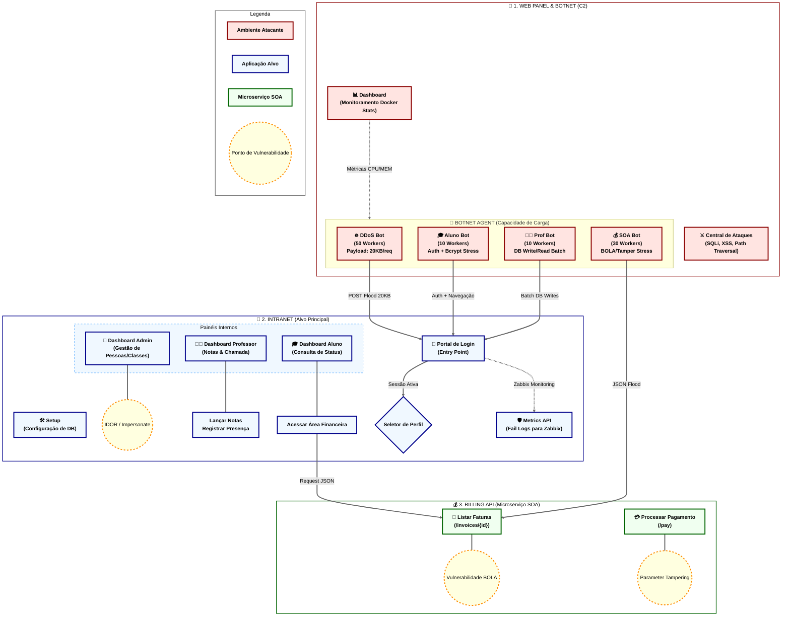

# Diagrama de Funcionalidades e Rotas

Este documento detalha a arquitetura lógica, os fluxos de dados, os pontos de vulnerabilidade e a capacidade de carga da Botnet que compõem o ecossistema de monitoramento.

## Mapa de Fluxo, Interações e Capacidade de Carga

## Especificações Técnicas e Carga do Sistema

### 1. Botnet Agent (Capacidade de Simulação)
O projeto utiliza um motor assíncrono (`aiohttp`) para gerar carga volumétrica e estressar o monitoramento.

| Tipo de Bot | Qtd de Workers | Ações Principais | Impacto no Monitoramento |
| :--- | :---: | :--- | :--- |
| **DDoS Bot** | 50 | POST Flood com payload de 20KB de dados lixo. | Estresse de CPU no Firewall e IPS (Suricata). |
| **Aluno Bot** | 10 | Login (Bcrypt), navegação randômica, consulta de notas. | Estresse de CPU (Criptografia) e Sessions. |
| **Prof Bot** | 10 | Login, lançamento de notas em massa, registro de presença. | Estresse de I/O de Banco de Dados (MySQL). |
| **SOA Bot** | 30 | Acesso direto a faturas (BOLA) e fraudes de valor (Tampering). | Gatilhos de DLP (Vazamento de Cartão de Crédito). |

### 2. Recursos e Monitoramento Docker
O **Web Panel** consome a API do Docker Engine para expor métricas em tempo real:

- **CPU Usage (%)**: Calculado via `cpu_delta` e `system_delta`, permitindo ver o impacto de cada bot no host.
- **Memory Usage (%)**: Monitoramento de *Memory Leaks* durante testes de estresse longos.
- **I/O Batching**: O simulador de professor utiliza `aiomysql` com `pool_size=100` e `max_overflow=200` para suportar milhares de requisições simultâneas.

### 3. Recursos de Infraestrutura (VEX)
O projeto está preparado para rodar em arquiteturas virtualizadas com as seguintes metas:

- **Alvo (Intranet)**: VM com 4 vCPUs e 4GB RAM (Mínimo recomendado para Bcrypt stress).
- **Atacante (Web Panel)**: VM com 2 vCPUs e 2GB RAM.
- **Banco de Dados**: MySQL 8.0 otimizado para conexões simultâneas.

---
*Este diagrama é atualizado automaticamente conforme novas rotas ou capacidades de carga são integradas ao sistema.*
